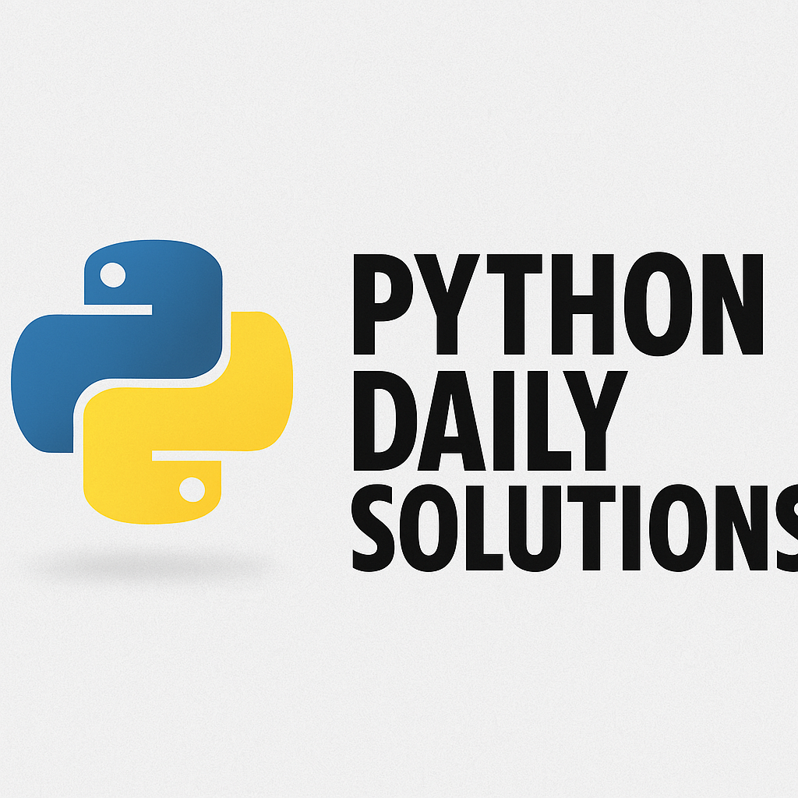

<p align="center">
  
</p>

<p align="center"><i>Daily Python challenges to sharpen your skills</i></p>

<p align="center">
  
  
  
</p>

---

## 🧠 About This Repository

Welcome to **Python Daily Solutions** — a personal coding journey focused on solving one Python problem every day.  
This initiative helps improve consistency, problem-solving skills, and code quality with clean, professional practices.

---

## 📁 Folder Structure

```
problems/
├── 2025-08-03
├── 2025-08-04
├── 2025-08-05
├── ...
```

Each folder follows the format `YYYY-MM-DD` to represent the solving date.

---

## 🚀 How to Run

To run any solution file:

```bash
python problems/ReverseWord.py
```

Example:

```bash
python problems/ReverseWord.py
```

---

## 📅 Daily Log

| Date       | Topic                  | Status     |
|------------|------------------------|------------|
| 2025-08-02 | Strings                | ✅ Done    |
| 2025-08-03 | List                   | ✅ Done    |
| 2025-08-04 | Touple                 | ✅ Done    |
| 2025-08-05 | Set                    | ✅ Done    |
| 2025-08-06 | To-Do List Manager     | ✅ Done    |
| 2025-08-07 | Dictionary             | ✅ Done    |
| 2025-08-08 | If-Else Statement      | ✅ Done    |
| 2025-08-09 | Match                  | ✅ Done    |
| 2025-08-10 | While-Loops            | ✅ Done    |
| 2025-08-11 | For-Loops              | ✅ Done    |
| 2025-08-12 | Functions               | ✅ Done    |
| 2025-08-13 | Modules               | ✅ Done    |
| 2025-08-14 | Class & Objects            | ✅ Done    |
| 2025-08-15 | Inheritance            | ✅ Done    |
| 2025-08-16 | ⏳ Coming Soon         | 🔄 Pending |

---

## 🎯 Goals

- Build consistency through daily coding  
- Improve problem-solving accuracy  
- Maintain clean, production-quality code  
- Showcase daily progress

---

## 🙋‍♂️ Author

**Shefaul Islam Shefa**  
_Backend Developer | Competitive Programmer | Creative Technologist_

✉️ Email: [sishefa19@gmail.com](mailto:sishefa19@gmail.com)

🔗 [LinkedIn](https://www.linkedin.com/in/sishefa19/)

💻 [GitHub Profile](https://github.com/shefa19)

---
